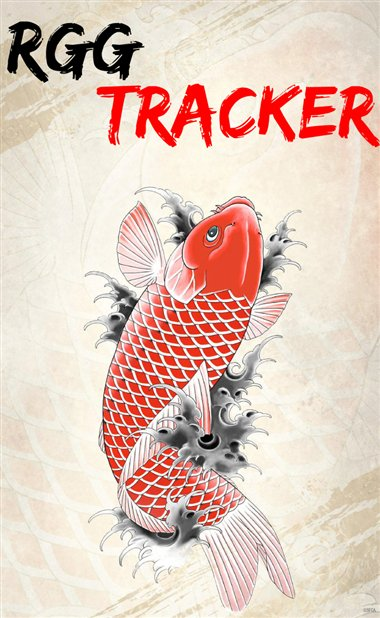

# RGG Tracker

Interactive Platinum/100% checklists for the Yakuza / Like a Dragon series — chapters, substories, business management, jobs, minigames, and everything else that counts toward completion, not just the trophy list.



**Live site:** https://rennfahreru.github.io/RGG-Tracker/

## What this is

A static, no-backend website. Each game gets its own checklist page with:

- Every chapter, substory, and trophy requirement as a checkbox
- Live progress bars, medal tallies, and a platinum-completion estimate
- Direct links to the relevant page of the source guide for full step-by-step detail
- Progress saved locally in your browser (`localStorage`) — nothing is sent to a server
- Export/Import buttons to back up progress or move it to another device

## What this is not

This is an unofficial, non-commercial fan project. It is **not affiliated with, endorsed by, or produced by SEGA, RGG Studio, CyricZ, or GameFAQs**.

**On data sources:** Chapter names, trophy names, and completion requirements are factual game data (trophy lists are published by the platform holders — Sony/Microsoft/Steam — and are the same across every guide and every player's game). Where a requirement needed more context, this project cross-referenced multiple public sources, primarily [CyricZ's guides on GameFAQs](https://gamefaqs.gamespot.com/search?game=yakuza&type=all), which are also linked throughout the site for anyone who wants the full walkthrough. **No guide text is reproduced here** — every description on this site is written independently and kept short on purpose; the linked guide is the place to go for the actual step-by-step. If you're the author of a linked guide and want a link changed or removed, open an issue.

Game titles, cover art, and other trademarks belong to SEGA / RGG Studio. Cover art is used here at reduced size purely for identification (which game a checklist page belongs to), not for redistribution.

## Project structure

```
site/                        deployed as the GitHub Pages root
  index.html                 landing page — the game selector grid
  shared/
    site.css                 shared design system (tokens, layout, components)
    tracker.js                shared save/export/import logic (ES module)
  games/
    <game-slug>/index.html   one checklist page per game
  assets/covers/              cover art (optimized, ~20-60KB each)

yakuza-like-a-dragon-tracker.html   standalone single-file version of the
                                     Like a Dragon tracker — works offline,
                                     no server needed, opens with a double-click
```

`.github/workflows/deploy.yml` redeploys `site/` to GitHub Pages automatically on every push to `main` that touches it.

## Running locally

The site pages use ES modules, which browsers block under `file://`. Serve the `site/` folder over plain HTTP:

```bash
cd site
python -m http.server 8080
# open http://localhost:8080/
```

Any static file server works the same way (`npx serve`, etc.) — it just needs to be run from inside `site/`, not the repo root.

## Adding a new game

1. Add cover art to `site/assets/covers/` (optimize it first — see below), then add a card for it in `site/index.html`'s game grid.
2. Copy `site/games/like-a-dragon/` as a starting template for the new game's folder.
3. In the new page's `<script type="module">`, give it its own unique `localStorage` key via `createStorage('<game>-tracker-v1', ...)` so progress doesn't collide with other games.
4. Rebuild the `TROPHIES` array and checklist markup from that game's actual trophy list and guide.

**Optimizing cover art** (PowerShell, no extra tools needed — uses .NET's built-in `System.Drawing`):

```powershell
Add-Type -AssemblyName System.Drawing
$img = [System.Drawing.Image]::FromFile("original.png")
# resize to ~420px on the long edge, save as JPEG quality ~84
```

Keep filenames lowercase-hyphenated (`yakuza-0.jpg`, not `Yakuza_0.PNG`) to match the rest of `assets/covers/`.

## License

The code in this repository is MIT-licensed (see `LICENSE`) — that covers the HTML/CSS/JS only. It does not cover Yakuza series trademarks, characters, or cover art, which remain the property of SEGA / RGG Studio.
